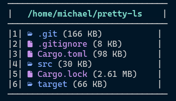

# Pretty ls

Simple directory listing command written in Rust



## Installation

1. Clone this repostitory
```
git clone https://github.com/MichaelLF107/pretty-ls.git
```

2. Build the project
```
cargo build --release
```

3. Move the `pretty-ls` file inside the `target/release` folders to any directory
